# Clinic Care — Architecture Guide

A complete tour of how this app is built, written so that someone seeing the project for the
first time can follow it end to end. No prior knowledge of Expo or Supabase is assumed.

> **Reading tip:** the diagrams are written in [Mermaid](https://mermaid.js.org). GitHub, GitLab
> and most Markdown previews (including VS Code's) render them as real pictures. If you see raw
> text instead, your viewer doesn't support Mermaid — paste the block into
> [mermaid.live](https://mermaid.live) to see it drawn.

---

## 1. What the app does

**Clinic Care** is a mobile app for a **single doctor running their own practice**. It is *not* a
patient-facing app — patients never log in. The doctor signs up, and from then on the app is their
private workspace:

| The doctor can… | Where in the app |
| --- | --- |
| Sign up, confirm their email, sign in | `login`, `register`, `confirm-signup` (`reset-password` is still a placeholder) |
| See a day-by-day appointment calendar | `dashboard` |
| Add patients, with a case study photo and/or notes | `add-patient` |
| Search patients by name or phone number | `dashboard` |
| Open a patient's profile, call them, record a "visit" (clock in) | `patients/[id]` |
| Review a patient's visit history and details | `patients/[id]/visits`, `patients/[id]/details` |
| Schedule, reschedule and delete appointments | `dashboard` → schedule sheets |
| Share a public booking link, and accept or decline the requests it brings in | `account`, `dashboard` |
| Edit their profile, change email/password, delete the account | `account` |

The **one public page** is the booking form at `/book/<token>`. Anyone with the link can ask for an
appointment. They cannot see any patient data — they can only leave a request that the doctor
reviews later.

---

## 2. The 30-second version

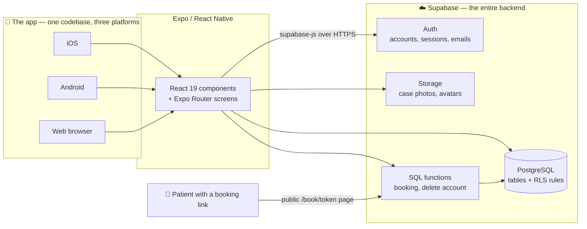

Two sentences worth remembering:

1. **There is no server of our own.** No Node backend, no Express, no API routes. The app talks
   straight to Supabase, and the *database itself* enforces who may read or write what.
2. **One codebase runs everywhere.** The same React components render as native iOS/Android views
   and as a web page.

---

## 3. Tech stack

| Layer | Choice | What it actually does here | Why this one |
| --- | --- | --- | --- |
| App framework | **Expo SDK 57** (React Native 0.86, React 19.2) | Turns React code into real native apps | Handles native builds, updates and hundreds of device APIs so we never open Xcode |
| Language | **TypeScript 6** (`strict`) | Types every prop, row and function | Catches "this column can be null" bugs before the app runs |
| Navigation | **Expo Router 57** | File-based routing: a file in `src/app/` *is* a screen | Same mental model as Next.js; gives us deep links and web URLs for free |
| Backend | **Supabase** (Postgres 17, Auth, Storage) | Database, login, file uploads, server-side functions | One managed service replaces a whole backend team's worth of plumbing |
| DB client | **@supabase/supabase-js 2** | Type-safe queries, session handling, auto token refresh | Official client; generated types line up with our schema |
| Session storage | **expo-sqlite** (native) / `window.localStorage` (web) | Remembers the login between app launches | SQLite-backed storage is Expo's recommended native option |
| Styling | **React Native `StyleSheet` + a custom theme** | Colors come from `src/constants/theme.ts` via a context | No CSS framework needed; light/dark handled in one place |
| Icons & images | `@expo/vector-icons` (Ionicons), `expo-image` | Icons and cached remote images | Ship with Expo, work on all three platforms |
| Animation | **Reanimated 4** + `Animated` | Intro heartbeat animation, drawer slide | Reanimated runs animations on the UI thread |
| Media | `expo-image-picker`, `expo-file-system` | Camera/library photo picking and reading bytes | Needed for case-study photos and avatars |
| Compiler | **React Compiler** (`experiments.reactCompiler`) | Auto-memoizes components | Fewer re-renders without hand-written `useMemo` |
| Lint / typecheck | ESLint (`eslint-config-expo`), `tsc --noEmit` | Quality gates | Run both before calling any task done |
| Build & release | **EAS** (planned) | Cloud builds, store submission, OTA updates | No local Android Studio / Xcode required |

> **Why "no backend" is safe:** the key shipped inside the app (`EXPO_PUBLIC_SUPABASE_PUBLISHABLE_KEY`)
> is *meant* to be public. It grants nothing by itself. Every request carries the signed-in doctor's
> token, and Postgres **Row Level Security** decides row by row what that token may touch. See §7.

---

## 4. How the pieces fit together

The app code is layered. Each layer only talks to the one below it.

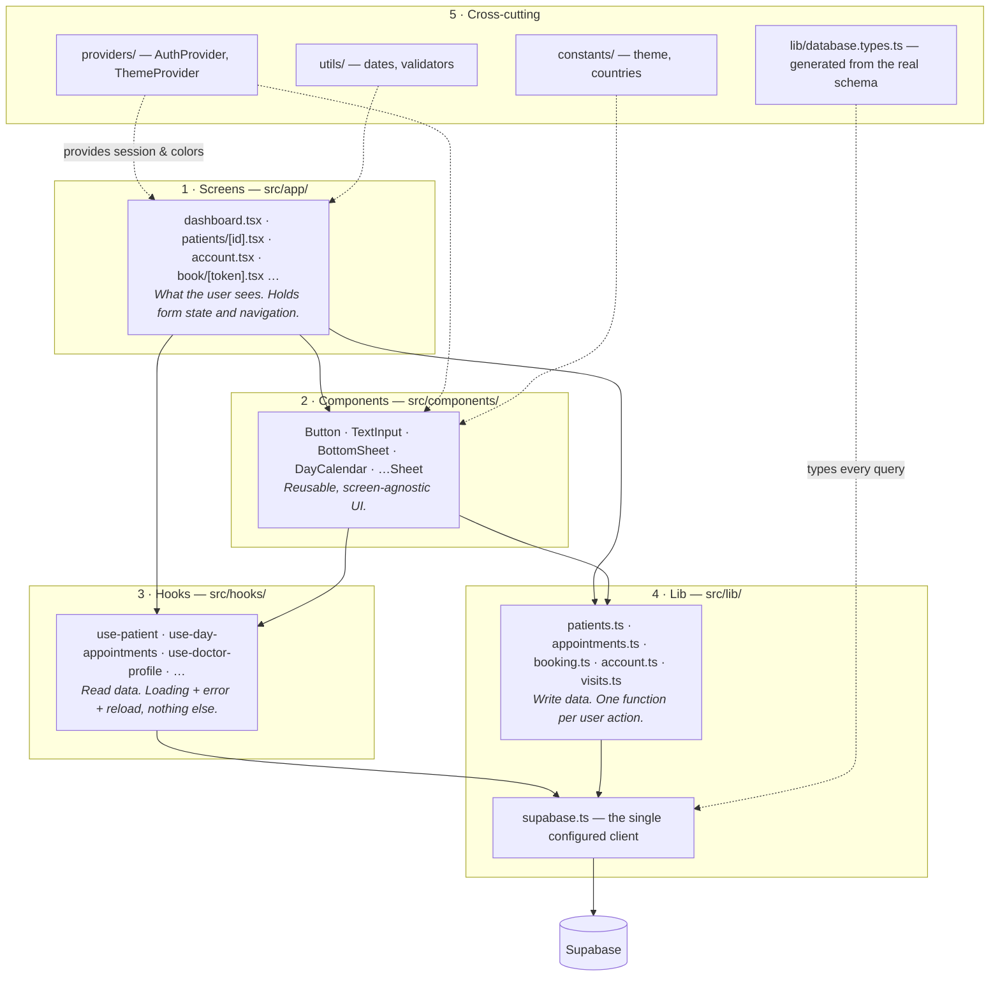

**The rules that keep this tidy:**

- `src/app/` contains **routes only**. Every file there is a screen. Anything reusable lives outside it.
- **Hooks read, lib writes.** If you need a list on screen, it's a hook. If the user pressed a button
  that changes something, it's a `lib/` function.
- **One Supabase client**, created once in `src/lib/supabase.ts` and imported everywhere.
- Imports use the `@/` alias (`@/lib/supabase` → `src/lib/supabase`), configured in `tsconfig.json`.

### Repository map

```
doctor-app/
├── src/
│   ├── app/                   # ROUTES ONLY — every file is a screen
│   │   ├── _layout.tsx        # Root: AuthProvider → ThemeProvider → Stack navigator
│   │   ├── index.tsx          # Animated intro, then redirects to /dashboard or /login
│   │   ├── login.tsx  register.tsx  reset-password.tsx  confirm-signup.tsx
│   │   ├── dashboard.tsx      # Home: greeting, search, quick actions, day calendar, drawer
│   │   ├── add-patient.tsx
│   │   ├── account.tsx        # Profile, photo, password, email, booking link, delete
│   │   ├── patients/
│   │   │   ├── index.tsx      # Patient list (uses the patient_overview view)
│   │   │   ├── [id].tsx       # Patient profile + "Clock in"
│   │   │   └── [id]/details.tsx, [id]/visits.tsx
│   │   └── book/[token].tsx   # 🌐 PUBLIC booking form — no sign-in
│   ├── components/            # 24 reusable pieces: inputs, sheets, calendar, top bar…
│   ├── hooks/                 # 9 data-reading hooks
│   ├── lib/                   # Supabase client + all write operations + generated types
│   ├── providers/             # auth-provider.tsx, theme-provider.tsx
│   ├── constants/             # theme.ts (palettes), countries.ts (dial codes)
│   └── utils/                 # dates.ts, validators.ts
├── supabase/
│   ├── migrations/            # 12 .sql files — the database's entire history
│   ├── templates/             # confirm-signup.html (the sign-up email)
│   └── config.toml            # Supabase CLI settings for local development
├── assets/                    # Icons, splash images, logo
├── app.json                   # Expo config: plugins, permissions, icons, experiments
└── package.json
```

`android/` and `ios/` are **generated** (Continuous Native Generation) and git-ignored. Never edit
them by hand — change `app.json` instead and let Expo regenerate them.

---

## 5. Screens and navigation

Expo Router maps the file tree to URLs. `src/app/patients/[id].tsx` becomes `/patients/abc-123`,
and `[id]` is read with `useLocalSearchParams()`.

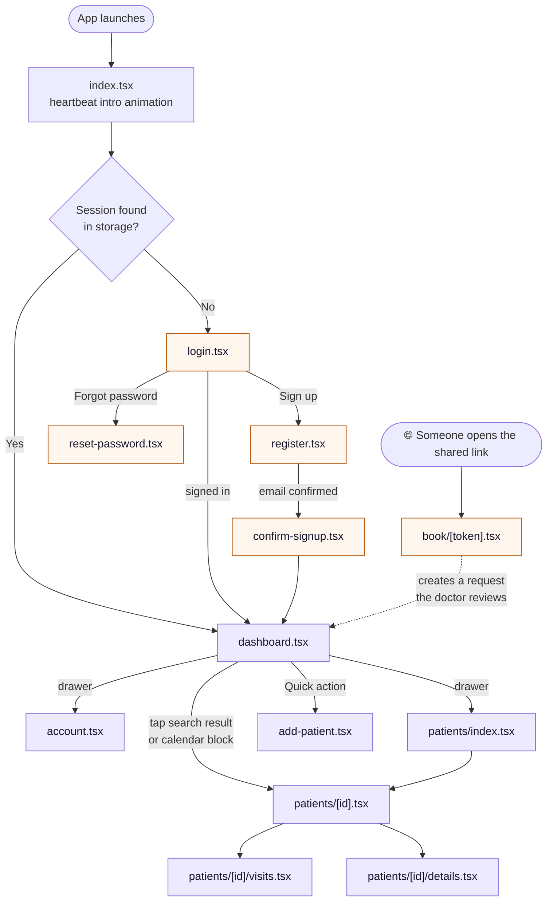

Purple screens are **guarded**: each one calls `useAuth()` and renders
`<Redirect href="/login" />` when there is no session. That guard is deliberately repeated per
screen rather than hidden in the layout, so a screen is never half-rendered with no user.

The dashboard's "drawer" is a `Modal` with an animated slide-in panel, not a navigator — it holds
navigation links, the theme toggle and Sign out.

---

## 6. The database

### Entity-relationship diagram

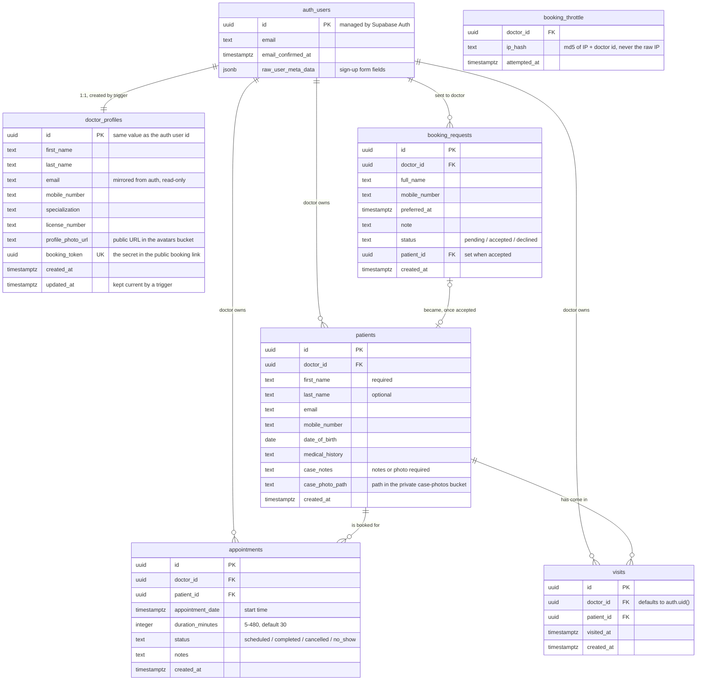

**Appointment vs visit — the distinction that confuses everyone first time:**

- An **appointment** is a *plan*: "Ravi, Thursday 4:30 PM, 30 minutes." It lives on the calendar.
- A **visit** is a *fact*: "Ravi walked in at 4:34 PM." It is created by the "Clock in" button and
  builds the patient's history. A visit needs no appointment, and an appointment may never become one.

### Table notes

- **`doctor_profiles`** shares its primary key with `auth.users`. A doctor's id *is* their user id,
  which is why `doctor_id` everywhere points at `auth.users`.
- **`email` is mirrored, not authoritative.** Triggers copy it from `auth.users` at sign-up and on
  every email change, and a column-level grant means the app cannot write it directly.
- **Every child row cascades.** Delete the auth user → profile, patients, visits, appointments and
  booking requests all go with it. Storage files do *not* cascade (see §8, Delete account).
- **`booking_throttle` is deliberately forgetful.** Rows older than an hour are deleted on the next
  write, so it never becomes a log of who visited which doctor's form.

### The view

`patient_overview` is the patient list's query, kept in SQL instead of the client:

```sql
select p.id, p.first_name, p.last_name, p.mobile_number, p.created_at,
       count(v.id)::integer as visit_count,
       max(v.visited_at)   as last_visit_at
from patients p
left join visits v on v.patient_id = p.id
group by p.id;
```

It is created `with (security_invoker = true)` — meaning it runs with **the caller's** permissions,
not the view owner's, so RLS still applies and no doctor can see another's patients through it.
Forgetting that flag is one of the classic Postgres data leaks.

### Triggers and functions

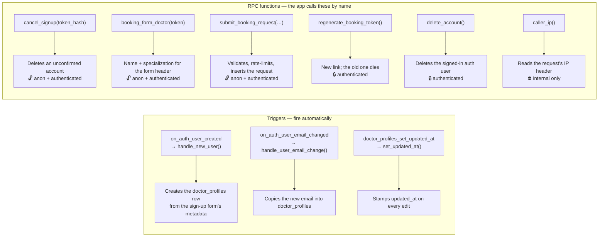

Every one of these is `security definer`, meaning **it runs with the owner's rights, not the
caller's** — that's how an anonymous visitor can insert a booking request without having any
permission on the `booking_requests` table. Each also sets `search_path = ''` and is explicitly
`revoke`d from `public` before being granted to just the roles that need it. That trio
(`security definer` + empty search path + narrow grants) is the standard safe recipe.

---

## 7. The security model — Row Level Security

This is the most important idea in the project, so here it is slowly.

Normally an app protects data in its backend code: "if user.id != patient.doctor_id, return 403."
We have no backend code to put that check in. Instead, **the rules live in the database** as RLS
policies, and Postgres applies them to every single query — even one typed by hand into a SQL
console with a stolen key.

A policy is just a SQL condition attached to a table:

```sql
create policy "Doctors read own patients" on public.patients
  for select to authenticated
  using ((select auth.uid()) = doctor_id);
```

`auth.uid()` is the user id taken from the JWT that supabase-js attached to the request. So the
query `select * from patients` silently becomes `select * from patients where doctor_id = <me>`.
There is no way to opt out of it from the client.

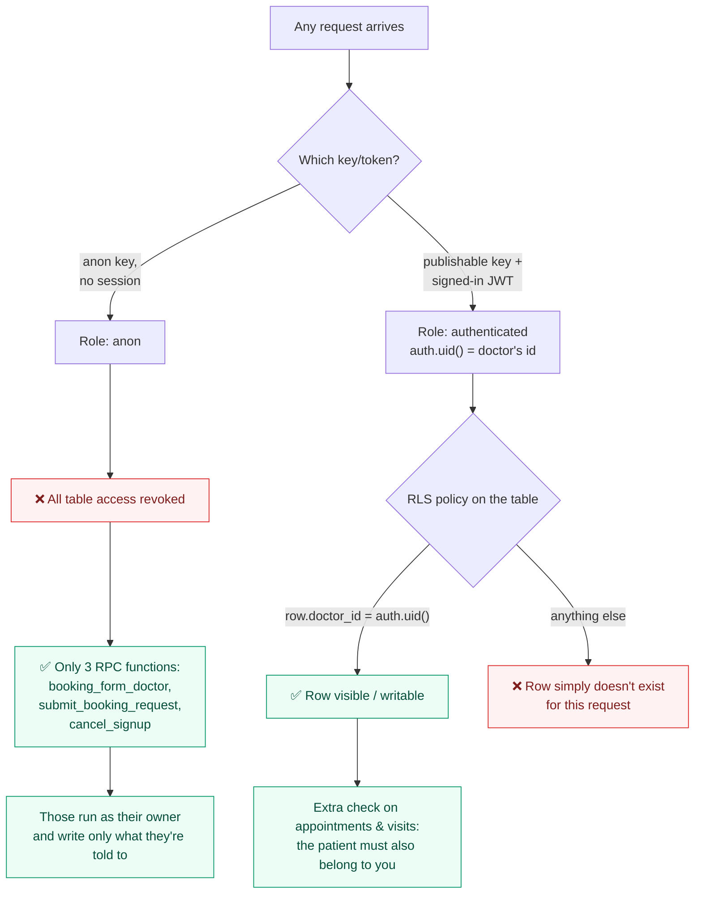

Four layers of defence, from outside in:

1. **Role grants.** `revoke all … from anon` — a signed-out visitor has no table access at all.
2. **RLS policies.** Per-row ownership checks on every table, for select/insert/update/delete
   separately. `appointments` and `visits` go further: their insert/update policies also require
   that the referenced patient belongs to you, so you cannot attach an appointment to a stranger.
3. **Column grants.** `doctor_profiles` update is granted only on the six editable columns —
   `email`, `id` and the timestamps are not writable by the app at all.
4. **Function boundaries.** Public actions happen only through `security definer` functions that
   validate their input, so the public surface is three named functions instead of a table.

### Storage buckets

| Bucket | Public? | Limit | Holds | Path convention |
| --- | --- | --- | --- | --- |
| `case-photos` | **Private** | 10 MB, images only | Patient case-study photos | `<doctor_id>/<random>.jpg` |
| `avatars` | Public | 5 MB, images only | Doctor profile photos | `<doctor_id>/avatar-<timestamp>.jpg` |

Case photos are uploaded and deleted by the app, but nothing reads one back yet — the patient
details screen shows the case *notes* only. Displaying the photo will need a signed URL, since
the bucket is private. Avatars are in a public bucket precisely because the profile photo is
rendered from a plain URL stored in `doctor_profiles.profile_photo_url`.

Storage policies match on the **first folder segment** of the object path:

```sql
using (bucket_id = 'case-photos'
       and (storage.foldername(name))[1] = (select auth.uid())::text)
```

So the folder name *is* the permission. A doctor can only read, write or delete inside the folder
named after their own user id.

### Rate limiting the public form

The booking form is the only door open to the internet, so `submit_booking_request` guards it twice:

- **Per phone number:** at most 3 *pending* requests to one doctor.
- **Per IP, per doctor:** at most 30 per hour, counted in `booking_throttle`.

The IP is never stored raw — it is `md5(ip || doctor_id)`, so the same visitor hashes differently
for each doctor and the rows cannot be joined into a browsing history. The IP itself is read from
`cf-connecting-ip` (set by Cloudflare's edge, un-spoofable) falling back to the **rightmost** entry
of `x-forwarded-for` — the leftmost entry is attacker-controlled, a detail that trips up most
hand-rolled rate limiters.

---

## 8. Key flows, step by step

### 8.1 Sign-up and email confirmation

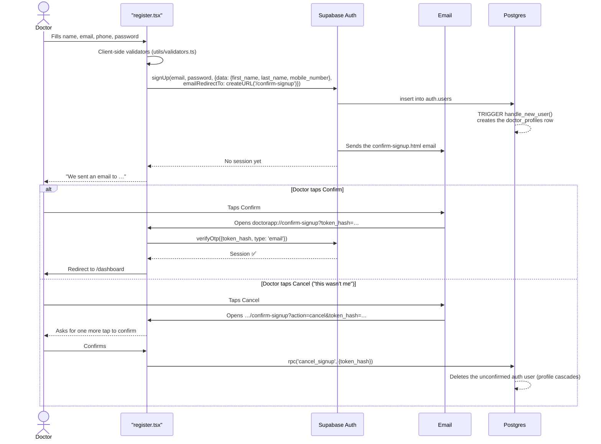

Two details worth copying into your own projects:

- **Nothing happens on a plain link fetch.** Corporate mail scanners follow every link in an email.
  Confirmation runs in the app, and cancelling needs a second tap, so a scanner can't confirm or
  destroy an account by accident.
- **Tokens are single-use**, so `confirm-signup.tsx` keeps a `useRef` guard to survive React's
  development-mode double-run of effects.

### 8.2 Sessions — staying signed in

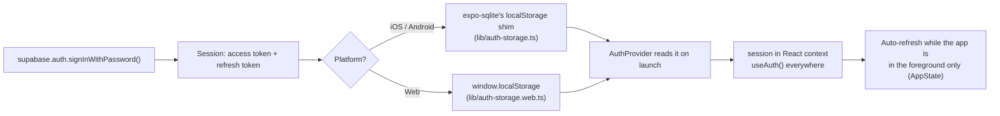

`AuthProvider` also solves a subtle problem: when a doctor changes their email, the confirmation
happens in *Supabase*, not in the app, so the stored session never hears about it. While a change
is pending the provider polls `getUser()` every 10 seconds (and whenever the app returns to the
foreground), refreshes the session once the address differs, and raises `emailChangedTo` so
`EmailChangedModal` can announce it.

### 8.3 Adding a patient with a case photo

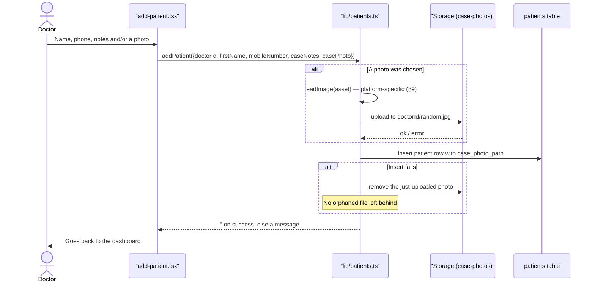

The database enforces the business rule with a `check` constraint: a patient must have **case notes
or a case photo** — an empty record is rejected by Postgres, not just by the form.

### 8.4 Scheduling an appointment (clash detection)

```mermaid
flowchart TD
    A["Doctor taps an empty 30-min slot<br/>on the day calendar"] --> B["ScheduleAppointmentSheet opens"]
    B --> C["Pick patient, start time, duration"]
    C --> D["useBookedSlots(from, to) loads<br/>nearby appointments"]
    D --> E["Query looks back 60 minutes<br/>— the longest bookable appointment"]
    E --> F["clashingSlots&#40;&#41;: keep any slot that starts<br/>before the block ends AND ends after it starts"]
    F --> G{"Any overlap?"}
    G -- Yes --> H["⚠️ Warn: 'runs into Ravi Kumar's appointment'"]
    G -- No --> I["addAppointment() inserts the row"]
    H --> J["Doctor changes the time,<br/>or books anyway"]
    J --> I
    I --> K["reload() — the calendar refetches"]

    classDef warn fill:#fef6e7,stroke:#B45309,color:#1B1A33
    class H,J warn
```

**Why look back an hour?** A 60-minute appointment starting at 3:30 overlaps a 4:00 slot even
though its *start* is outside the window. Querying only `start >= windowStart` would miss it. This
is the classic interval-overlap bug, and the fix is the standard overlap test shown above —
note that appointments which merely touch end-to-start are *not* a clash.

### 8.5 The public booking form, end to end

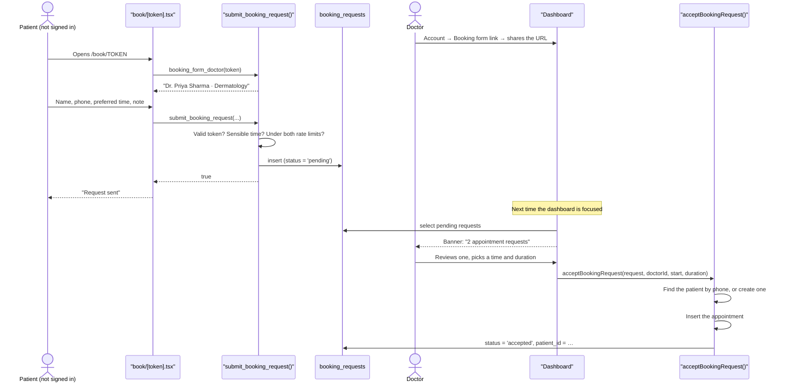

Request lifecycle:

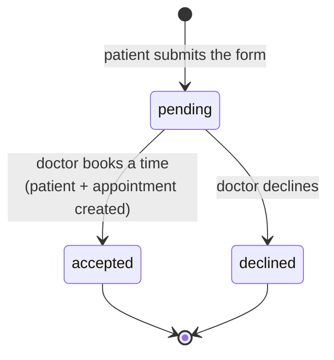

And an appointment's own states, from the `check` constraint on `appointments.status`:

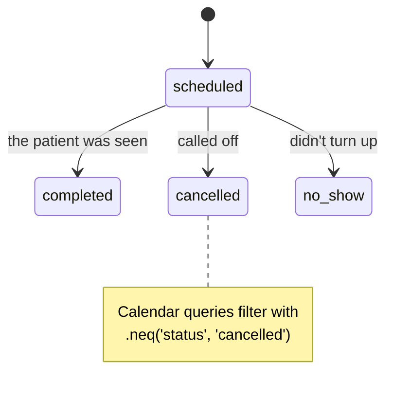

Regenerating the token (Account → Booking form link → Regenerate) issues a new UUID, which
instantly kills every copy of the old link — useful if it ends up somewhere it shouldn't.

### 8.6 Deleting the account

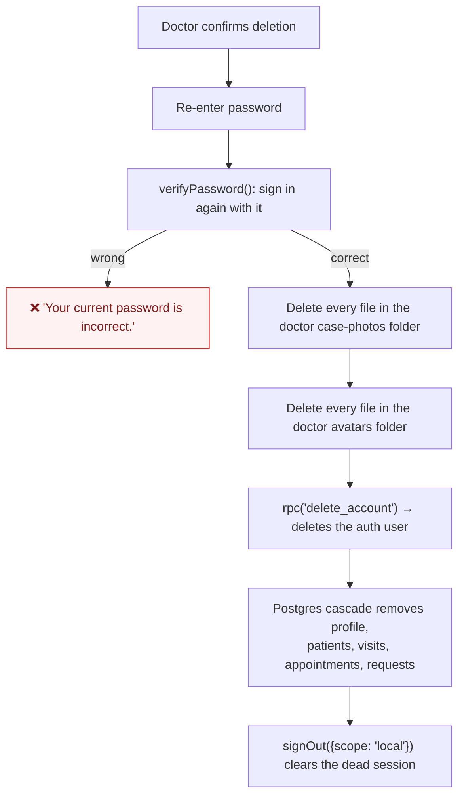

**Storage first, database second** — and this order is not optional. SQL cannot delete storage
objects, so once the auth user is gone the app has no permission to reach those folders and the
files would be stranded forever.

Sensitive actions (change password, change email, delete account) all re-verify the password by
signing in again. It costs one request and stops someone using an unlocked, unattended phone.

---

## 9. Cross-platform: how one codebase serves three platforms

React Native's bundler picks `foo.web.ts` over `foo.ts` when building for web. The project uses
this twice, and both times for the same reason — a native module simply doesn't exist in a browser:

| Concern | `*.ts` (iOS/Android) | `*.web.ts` (browser) |
| --- | --- | --- |
| Session storage | `expo-sqlite`'s `localStorage` shim | `window.localStorage`, guarded because there is no `window` during static rendering |
| Reading a picked image | `expo-file-system`'s `File(...).arrayBuffer()` | The browser `File` object the picker hands back, or `fetch(uri).blob()` |

Elsewhere, `Platform.OS` handles smaller differences inline — for example `bookingFormUrl()` falls
back to `window.location.origin` on web when `EXPO_PUBLIC_WEB_URL` isn't set.

Web output is configured as `static` in `app.json`, which is what makes `/book/<token>` a real,
shareable, server-rendered URL rather than something that only exists inside a running app.

---

## 10. State management and the data-loading pattern

There is **no Redux, Zustand or React Query here**. State is split three ways:

| Kind of state | Where it lives | Example |
| --- | --- | --- |
| Global, app-wide | React Context providers | `session` (AuthProvider), `colors`/`mode` (ThemeProvider) |
| Server data | Per-screen hooks in `src/hooks/` | the day's appointments, one patient, the profile |
| Form/UI state | `useState` in the screen | text fields, which bottom sheet is open |

Every data hook follows the same shape, and reading one means you can read all nine:

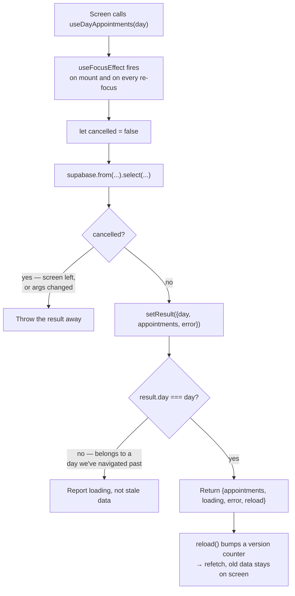

Three problems that pattern solves, all of which bite real apps:

1. **Stale writes.** The `cancelled` flag stops a slow response from overwriting newer data.
2. **Mismatched results.** Storing the *argument* alongside the result (`result.day === day`) means
   yesterday's appointments never flash up under today's heading.
3. **Refresh after changes elsewhere.** `useFocusEffect` refetches when you come back to a screen,
   so deleting a patient on one screen is reflected on the calendar without any global store.

`usePatientSearch` adds a 300 ms debounce and strips characters that are special in PostgREST
filters and `LIKE` patterns before building its `or(...)` query.

---

## 11. UI, theming and components

Theming is a context, not a stylesheet. `src/constants/theme.ts` exports two palettes with
identical keys (`primary`, `background`, `surface`, `text`, `error`, …). `ThemeProvider` picks one
from the OS colour scheme, lets the user override it with the drawer toggle, and every component
reads it with `useTheme()` and applies colours inline:

```tsx
const { colors } = useTheme()
<View style={[styles.card, { backgroundColor: colors.surface, borderColor: colors.border }]}>
```

Static layout lives in `StyleSheet.create`; only colours are dynamic. That keeps the fast path fast
while making dark mode a one-line change.

The component library, grouped by job:

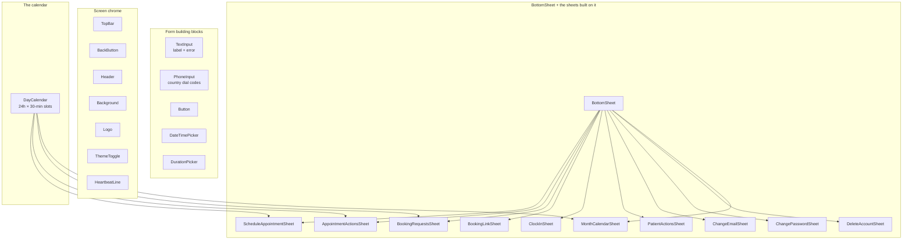

`DayCalendar` is the densest component: it lays out a full 24-hour day as 48 half-hour slots of
fixed height, positions each appointment as an absolutely-placed block from its start time and
duration, splits overlapping blocks side by side, draws a live "now" line that ticks every minute,
and auto-scrolls to a sensible hour when the day changes.

---

## 12. Configuration

| File | Holds |
| --- | --- |
| `app.json` | App name, scheme (`doctorapp://`), icons, splash, Android package, plugins, permission strings, `typedRoutes` + `reactCompiler` |
| `.env.local` (git-ignored) | `EXPO_PUBLIC_SUPABASE_URL`, `EXPO_PUBLIC_SUPABASE_PUBLISHABLE_KEY`, `EXPO_PUBLIC_WEB_URL` |
| `.env.example` | The template to copy — start here |
| `tsconfig.json` | `strict` mode and the `@/*` path alias |
| `supabase/config.toml` | Local Supabase stack settings (ports, auth rules, rate limits) |

Anything prefixed `EXPO_PUBLIC_` is **inlined into the app bundle at build time**. Treat it as
public — a service-role key or any secret must never be named that way, and in this architecture
none is needed on the client at all.

The permission strings in `app.json` (camera, photo library) are the sentences iOS shows in its
permission dialog. They mention patient case studies explicitly, because a vague string is a
common App Store rejection.

---

## 13. Running, building and releasing

```bash
cp .env.example .env.local     # then fill in your Supabase URL and key
npm install
npx expo start                 # dev server: press i, a or w

npx expo lint                  # lint
npx tsc --noEmit               # typecheck   ← run both before calling anything done
npx expo-doctor                # diagnose dependency/config problems
npx expo install <package>     # ALWAYS use this, never npm add — it picks SDK-compatible versions

npm run db:types               # regenerate src/lib/database.types.ts from the linked project
npx supabase migration new <name>   # new migration file
npx supabase db push                # apply migrations to the linked project
```

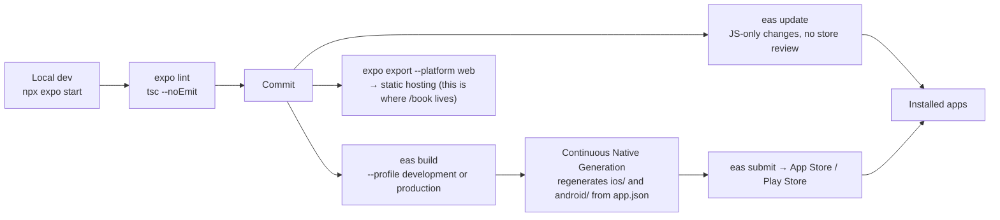

Two Expo rules this project lives by:

- **Never edit `ios/` or `android/` by hand.** They're regenerated from `app.json` on every build,
  so hand edits vanish. Native behaviour is configured through config plugins instead.
- **Expo Go isn't enough.** It only bundles Expo's own native modules. Because this app uses
  `expo-sqlite`, `expo-image-picker` and friends, day-to-day work needs a **development build**
  (`npx expo run:android` locally, or `eas build --profile development`).

Database changes ship as **migrations**: numbered SQL files in `supabase/migrations/`, applied in
filename order and never edited once pushed. To change something, add a new file — the folder is
the schema's full history, and `20260923130000_booking_ip_throttle_limit.sql` (raising the IP limit
from 3 to 30 after real patients on shared clinic wifi hit it) is a good example of that discipline.

---

## 14. Adding a feature — the recipe

Say you want "prescriptions" on a patient's profile.

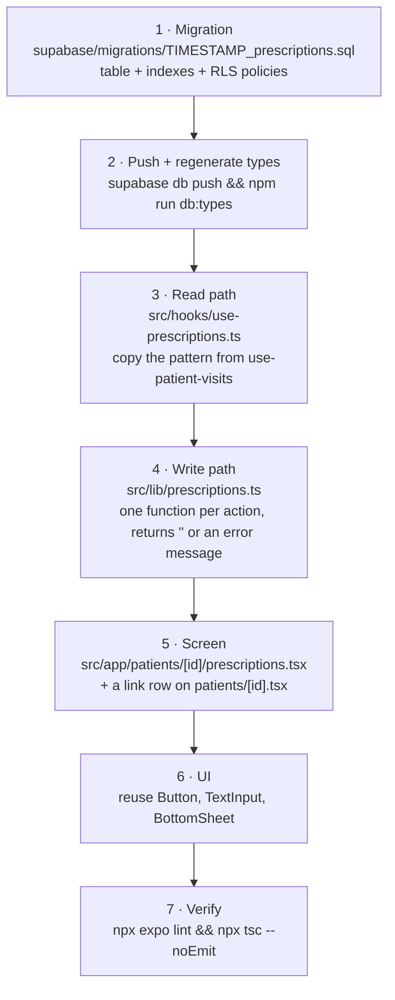

Conventions to match while you're in there:

- RLS on from the first migration — `enable row level security` plus four policies, and
  `revoke all … from anon`. A table without policies is either invisible or wide open; neither is
  what you want to discover later.
- Write functions return `''` on success and an error *message* on failure, so screens can render
  the string directly without try/catch ceremony.
- Hooks return `{ data, loading, error, reload }` — never throw.
- Files, folders and route segments are `kebab-case`; components are `PascalCase`.

---

## 15. What isn't built yet

Honest list, so nobody hunts for code that doesn't exist:

- **No tests.** No Jest, no Detox, no CI pipeline.
- **No EAS config.** `eas.json` and build profiles still need setting up.
- **Google sign-up is a placeholder** — the button shows "coming soon".
- **Password reset is a placeholder.** `reset-password.tsx` exists only so the login screen's
  link resolves; it renders "coming soon".
- **Case-study photos are write-only.** They upload and delete correctly, but no screen displays one.
- **Several tiles are stubs:** Appointments and Settings in the drawer, and the action tiles on the
  patient profile, show "Coming soon".
- **Compliance work is untouched.** This app stores health data, so HIPAA/DPDP obligations,
  at-rest encryption choices, audit logging and data-retention rules are all still open questions.
- **`patients.email`, `date_of_birth` and `medical_history` exist in the schema** but nothing in the
  UI writes them yet.
- **No push notifications** for new booking requests — the dashboard only finds out on focus.
